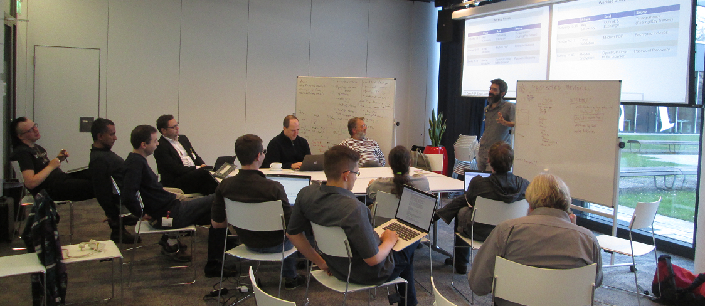
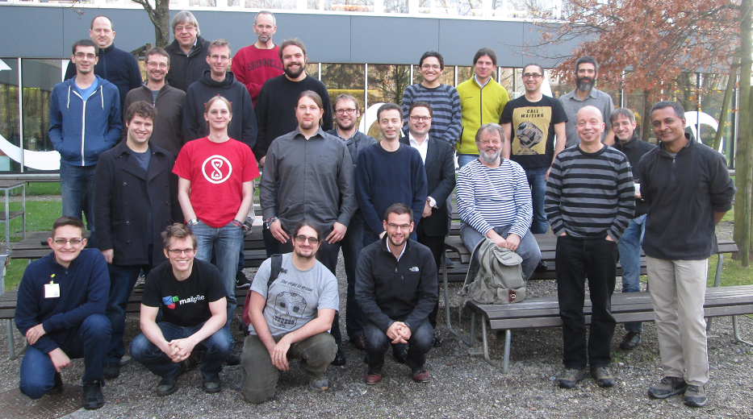
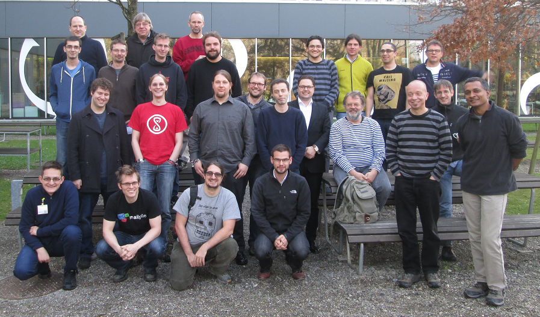
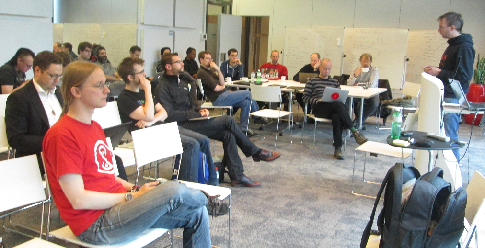

**Purpose:** Meeting of experts to discuss technical details of sending
encrypted emails using OpenPGP.
[Invitation](https://mailarchive.ietf.org/arch/msg/openpgp/C4uH_7bcyKkF9cm3HeRf5g3_DAI)

**Host:** Google, Zurich

**Rules:** By Default, we follow [Chatham House
Rules](https://en.wikipedia.org/wiki/Chatham_House_Rule): It is
fine to tell/write about what happened there, but we **need explicit
permission to quote statements by individual persons or to attach them
to organizations**.

**Pictures**:

**Agenda**:
[Slides](OpenPGPSummit_151206.pdf)

Saturday, Dec 05, 2015:

-   10:00: Welcome, Organizational Issues, Schedule
-   10:30: Introducing each other
-   12:00: Plenary Sessions (see below)
-   16:30: Organizing Working Groups
-   17:30: Fingerprint Exchange
-   19:15: Working Groups, part 1 (see below)

Sunday, Dec 06, 2015:

-   10:00: Working Groups, part 2 (see below)
-   11:45: Working Groups, part 3 (see below)
-   14:00: Working Group Reports
-   15:30: Wrap Up
-   16:00: End

## Plenary Sessions {#Plenary_Sessions}

-   Facebook and OpenPGP (Jon Millican, Facebook)
-   Pretty Easy Privacy (PEP), Enigmail, and Thunderbird (Volker Birk,
    PEP & Patrick Brunschwig, Enigmail)
    -   [Slides Patrick](Enigmail-pEp_OpenPGPSummit_2015-12-1.pdf)
-   Status [Header Encryption and Signing with "Memory
    Hole"](minutes/memory-hole) (Daniel Kahn Gillmor)
-   [Transparent Keyservers](key_transparency.pdf) (Gary Belvin,
    Google)

## Working Groups {#Working_Groups}

#### Workshops Saturday Evening: {#Workshops_Saturday_Evening:}

-   [Key Discovery Problems and Strategies](minutes/key-discovery)
-   [Dealing with Outlook & Exchange](minutes/outlook-and-exchange)
-   [Scaling Key Servers](minutes/scaling-key-servers) (follow-up
    Transparent Keyservers talk)

#### Workshops Sunday Early Morning: {#Workshops_Sunday_Early_Morning:}

-   [Email Validation](minutes/email-validation)
-   [Modern PGP Look&Feel](minutes/modern-pgp)
-   [Encrypted Index](minutes/encrypted-index)

#### Workshops Sunday Late Morning: {#Workshops_Sunday_Late_Morning:}

-   [Header Encryption and Signing with "Memory
    Hole"](minutes/memory-hole)
-   [OpenPGP close to the
    Browser](minutes/openpgp-close-to-the-browser)
-   [Password Recovery](minutes/password-recovery)

## Outcomes {#Outcomes}

#### Decision to establish an email list for "Email Encryption with OpenPGP" {#Decision_to_establish_an_email_list_for_.22Email_Encryption_with_OpenPGP.22}

-   Archive:
    [https://admin.hostpoint.ch/pipermail/openpgp-email_enigmail.net](https://admin.hostpoint.ch/pipermail/openpgp-email_enigmail.net)
-   Register:
    [https://admin.hostpoint.ch/mailman/listinfo/openpgp-email_enigmail.net](https://admin.hostpoint.ch/mailman/listinfo/openpgp-email_enigmail.net)
